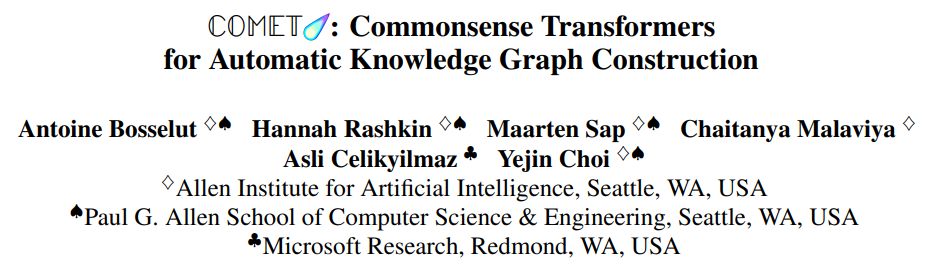

__Antoine Bosselut, Hannah Rashkin, Maarten Sap, Chaitanya Malaviya, Asli Celikyilmaz, Yejin Choi__
*Allen Institute for Artificial Intelligence, Seattle, WA, USA*
*Paul G. Allen School of Computer Science & Engineering, Seattle, WA, USA*
*Microsoft Research, Redmond, WA, USA*
*ACL'19*

>[Link of Paper](https://arxiv.org/abs/1906.05317)

